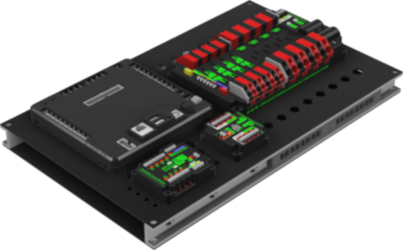

# Electrical-Pneumatic-Modules

This project contains all of the necessary files to  build the electrical and
pneumatic modules.

## Project Goals and Purpose

The primary goal of this project is to modularize the electrical and pneumatics
controls.  Both of these subsystems are needed year-over-year for FRC robots, so
standardizing the build process will allow the team to spend more time designing
the game-specific components.  The tradeoff to this design methodology is the
whole assembly will need to be placed instead of a *customized* fit for all of
the components.  To address this tradeoff, the pneumatics module was designed
without the compressor and storage tanks.  These will still need to be custom
placed on the robot each year.  The electrical moduleV is designed to be mounted
in several different orientations to aid in placement on the robot.  

## CAD

The CAD for the electrical module is in the /cad/electrical directory and the
CAD for the pneumatics module is in the /cad/pneumatics directory.  The *.STL
files are nice for viewing the parts in GitHub but it's the *.f3d files which
contain the workable CAD.  These are Fusion 360 CAD files. Hi does this work

## Electrical BOM

| Description | Manfacturer | Part Number | Quantity |
| ----------- | ----------- | ----------- | -------- |
| 250mmx400mmx2mm Carbon Fiber Plate | RJXHobby | RJX1750-P1 | 2 |
| 1"x0.5"x0.125" 6063 T52 Channel | OnlineMetals | 1061 | 29" |
| Anderson PP Mount Bottom | C.I.S. | CIS-EM-001 | 4 |
| Anderson PP Mount Top | C.I.S. | CIS-EM-002 | 4 |
| 1/8" Inside Diameter Rubber Grommet - 1/16" Groove Width - Fits 1/4" Holes | RubberFeetWarehouse | RG1814116 | 24 |
| 3/8" Inside Diameter Rubber Grommet - 1/16" Groove Width - Fits 1/2" Holes | RubberFeetWarehouse | 1RG381214 | 29 |
| 1/2" Inside Diameter Rubber Grommet - 1/16" Groove Width - Fits 3/4" Holes | RubberFeetWarehouse | RG1211634 | 7 |
| Black Square Self Adhesive Rubber Bumper Feet - 1/2" Wide x 1/2" Length x 1/8" Height | RubberFeetWarehouse | 50SAFBSQ | 50 |
| 2 Position Rectangular Housing Connector Receptacle Black 0.100" (2.54mm) | Molex, LLC | 50-57-9402 | 20 |
| 2 Position Rectangular Housing Connector Plug Black 0.100" (2.54mm) | Molex, LLC | 0701070001 | 20 |
| Pin Contact Gold 22-24 AWG Crimp | Molex, LLC | 0016020115 | 40 |
| Socket Contact Gold 22-24 AWG Crimp | Molex, LLC | 0016020103 | 40 |
| Socket button head, Stainless steel 18-8, #4-40 | BoltDepot | TBD |
| Socket button head, Stainless steel 18-8, #6-32 | BoltDepot | TBD |
| Hex lock nuts nylon insert, Stainless steel 18-8, #6-32 | BoltDepot | TBD |

## Pneumatics BOM

| Description | Manfacturer | Part Number | Quantity |
| ----------- | ----------- | ----------- | -------- |
| 200mmx300mmx3mm Carbon Fiber Plate | Hobby-Wing | AA0007 | 1 |
| High pressure manifold guide, 5-port | C.I.S. | CIS-PM-001 | 1 |
| Working pressure manifold guide, 3-port | C.I.S. | CIS-PM-003 | 1 |
| Nason pressure switch bracket | C.I.S. | CIS-PM-004 | 1 |
| .2in Spacer | C.I.S. | CIS-PM-002 | 5 |
| Push-to-connect union tee, 1/4" | NITRA | UT14 | 3 |
| Push-to-connect male branch tee, 1/4" tube to 1/8" NPT | NITRA | MBT14-18N | 2 |
| Push-to-connect union elbow, 1/4" | NITRA | UL14 | 1 |
| Push-to-connect 2-way inline manual shutoff valve, 1/4" | NITRA | HVU14-2 | 1 |
| Push-to-connect inline pressure regulator 15-120 psi, 1/4" | NITRA | PRU14 | 1 |
| Push-to-connect inline pressure gauge 0-170 psi, 1/4" | NITRA | PGU14 | 1 |
| Digital pressure gauge/sensor/switch, -14.5 to 145 psig range,  1/8" male NPT | ProSense | QPSH-AN-42 | 1 |
| Pressure switch, 1/8" male NPT | Nason | SM-2B-115R/443 | 1 |
| Brass threaded fitting, 1/8" female NPT to 1/8" female NPT | NITRA | BFFC-18N | 2 |
| Mounting bracket | NITRA | FBKT | 2 |
| Socket button head, Stainless steel 18-8, #6-32 | BoltDepot |  |
| Hex lock nuts nylon insert, Stainless steel 18-8, #6-32 | BoltDepot |  |
